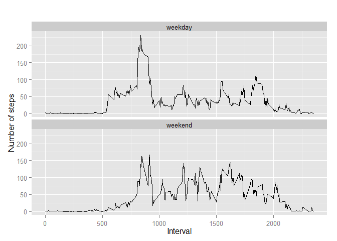

# Reproducible Research: Peer Assessment 1


## Loading and preprocessing the data


Show any code that is needed to

1.Load the data (i.e. read.csv()).

2.Process/transform the data (if necessary) into a format suitable for your    analysis.

```r
# load the csv in data frame
df <- read.csv("C:/Users/HP/Desktop/coursera_project/Reproducible research/activity.csv", as.is=TRUE)

head(df)
```

```
##   steps       date interval
## 1    NA 2012-10-01        0
## 2    NA 2012-10-01        5
## 3    NA 2012-10-01       10
## 4    NA 2012-10-01       15
## 5    NA 2012-10-01       20
## 6    NA 2012-10-01       25
```
## What is mean total number of steps taken per day?

For this part of the assignment, you can ignore the missing values in the dataset.

1.Make a histogram of the total number of steps taken each day

2.Calculate and report the mean and median total number of steps taken per day

```r
# Remove missing values from data
df2 <- na.omit(df)

head(df2)
```

```
##     steps       date interval
## 289     0 2012-10-02        0
## 290     0 2012-10-02        5
## 291     0 2012-10-02       10
## 292     0 2012-10-02       15
## 293     0 2012-10-02       20
## 294     0 2012-10-02       25
```

```r
# aggregate steps as per date to get total number of steps in a day
steps_by_day <- aggregate(steps ~ date, df2, sum)

# create histogram of total number of steps in a day
hist(steps_by_day$steps, col="blue", main="Histogram of total number of steps per day", xlab="Total number of steps in a day")
```

 

```r
# calculate mean and median total number of steps per day
rmean <- mean(steps_by_day$steps)
rmean
```

```
## [1] 10766.19
```

```r
rmedian <- median(steps_by_day$steps)
rmedian
```

```
## [1] 10765
```
## What is the average daily activity pattern?

1.Make a time series plot (i.e. type = "l") of the 5-minute interval (x-axis) and the average number of steps taken, averaged across all days (y-axis)

2.Which 5-minute interval, on average across all the days in the dataset, contains the maximum number of steps?

```r
# aggregate steps as per interval to get total number of steps in a day
steps_by_interval <- aggregate(steps ~ interval, df2, mean)

# generate the line plot of the 5-minute interval (x-axis) and the average number of steps taken, averaged across all days (y-axis)
plot(steps_by_interval$interval,steps_by_interval$steps, type="l", xlab="Interval", ylab="Number of Steps",main="Average Number of Steps per Day by Interval")
```

 

```r
# find row id of maximum average number of steps in an interval
max_ave_steps_row_id <- which.max(steps_by_interval$steps)

# get the interval with maximum average number of steps in an interval
steps_by_interval [max_ave_steps_row_id, ]
```

```
##     interval    steps
## 104      835 206.1698
```
## Imputing missing values

Note that there are a number of days/intervals where there are missing values (coded as NA). The presence of missing days may introduce bias into some calculations or summaries of the data.

1.Calculate and report the total number of missing values in the dataset (i.e. the total number of rows with NAs)

2.Devise a strategy for filling in all of the missing values in the dataset. The strategy does not need to be sophisticated. For example, you could use the mean/median for that day, or the mean for that 5-minute interval, etc.

3.Create a new dataset that is equal to the original dataset but with the missing data filled in.

4.Make a histogram of the total number of steps taken each day and Calculate and report the mean and median total number of steps taken per day. Do these values differ from the estimates from the first part of the assignment? What is the impact of imputing missing data on the estimates of the total daily number of steps?

```r
# get rows with NA's
df_NA <- df[!complete.cases(df),]

# number of rows
nrow(df_NA)
```

```
## [1] 2304
```

```r
# perform the imputation
for (i in 1:nrow(df)){
  if (is.na(df$steps[i])){
    interval_val <- df$interval[i]
    row_id <- which(steps_by_interval$interval == interval_val)
    steps_val <- steps_by_interval$steps[row_id]
    df$steps[i] <- steps_val
  }
}

# aggregate steps as per date to get total number of steps in a day
table_date_steps_imputed <- aggregate(steps ~ date, df, sum)

# create histogram of total number of steps in a day
hist(table_date_steps_imputed$steps, col="blue", main="(Imputed) Histogram of total number of steps per day", xlab="Total number of steps in a day")

#Create Histogram to show difference. 
hist(steps_by_day$steps, main = paste("Total Steps Each Day"), col="red", xlab="Number of Steps", add=T)
legend("topright", c("Imputed", "Non-imputed"), col=c("blue", "red"), lwd=10)
```

 

```r
# get mean and median of total number of steps per day
rmean.i <- mean(table_date_steps_imputed$steps)
rmean.i
```

```
## [1] 10766.19
```

```r
rmedian.i <- median(table_date_steps_imputed$steps)
rmedian.i
```

```
## [1] 10766.19
```

```r
# difference between imputed values and missing values
mean_diff <- rmean.i - rmean
mean_diff
```

```
## [1] 0
```

```r
med_diff <- rmedian.i - rmedian
med_diff
```

```
## [1] 1.188679
```
## Are there differences in activity patterns between weekdays and weekends?

For this part the weekdays() function may be of some help here. Use the dataset with the filled-in missing values for this part.

1.Create a new factor variable in the dataset with two levels - "weekday" and "weekend" indicating whether a given date is a weekday or weekend day.

2.Make a panel plot containing a time series plot (i.e. type = "l") of the 5-minute interval (x-axis) and the average number of steps taken, averaged across all weekday days or weekend days (y-axis).

```r
# convert date from string to Date class
df$date <- as.Date(df$date, "%Y-%m-%d")

# add a new column indicating day of the week 
df$day <- weekdays(df$date)

# add a new column called day type and initialize to weekday
df$day_type <- c("weekday")

# If day is Saturday or Sunday, make day_type as weekend
for (i in 1:nrow(df)){
  if (df$day[i] == "Saturday" || df$day[i] == "Sunday"){
    df$day_type[i] <- "weekend"
  }
}

# convert day_time from character to factor
df$day_type <- as.factor(df$day_type)

# aggregate steps as interval to get average number of steps in an interval across all days
table_interval_steps_imputed <- aggregate(steps ~ interval+day_type, df, mean)

# make the panel plot for weekdays and weekends
library(ggplot2)

qplot(interval, steps, data=table_interval_steps_imputed, geom=c("line"), xlab="Interval", ylab="Number of steps", main="") + facet_wrap(~ day_type, ncol=1)
```

 
